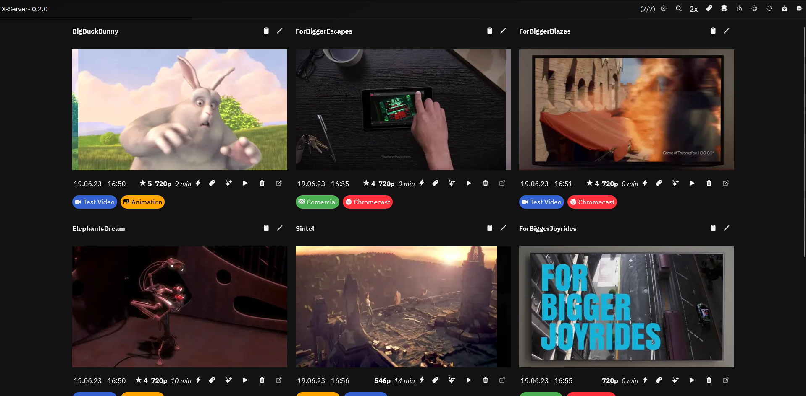

# XServer - [GrandLineX](https://www.grandlinex.com) Full Stack Demo Project

> Video Server with automatic metadata extraction and download service

## Includes

- Backend
  - Video Server with single user
  - User Authentication (Admin only)
  - In time streaming with ffmpeg 
  - Video thumbnail generation (ffmpeg, imagemagick)
  - Download service with yt-dlp or youtube-dl
  - Automatic video metadata extraction (ffmpeg, ffprobe)
  - Videos can be manuel labeled with tags
  - Postgres Database connection

- Frontend
  - Login Page
  - Video List Page
  - Single Video Detail Page
  - Video Download Page
  - Label management Page

## Used GLX-Packages

- Backend
  - [Express Kernel](https://www.grandlinex.com/kernel)   
    - Base backend package
  - [Elogger](https://www.grandlinex.com/bundle-elogger)
    - File Logging package 
  - [Postgresql](https://www.grandlinex.com/bundle-postgresql)
    - Postgress database integration
  - [Swagger-Mate](https://www.grandlinex.com/swagger-mate)
    - Automatic api generation for the React frontend

- Frontend
  - [React-Components](https://www.grandlinex.com/react-components)
    - React component library
  - [Swagger-Mate](https://www.grandlinex.com/swagger-mate)
    - Automatic api generation for the React frontend

## Quickstart Demo

- `docker compose  -f demo.docker-compose.yml up -d`
- Open `http://localhost:8080`
- Login with the demo pw `x_server_demo`
- Add library folder `/video` and set download = true
- Add media
  - Download a video from YouTube or other sources in the download section
  - Copy files to the `./demo/video` folder and start a rescan in the library section

## Quickstart
### Requirements
- [NodeJS](https://nodejs.org/en/) >= 16
- [ffmpeg](https://ffmpeg.org/)
- [imagemagick](https://imagemagick.org/index.php)
- [youtube-dl](https://youtube-dl.org/) or [yt-dlp](https://github.com/yt-dlp/yt-dlp)
- 
> make sure that ffmpeg, ffprobe, imagemagick and youtube-dl are in your PATH or set in the backend .env file
- Alternatively you can use the pre build container to run the backend (All requirements are included in the container)

### Install
1. Setup a postgres database
   - Use the docker-compose.yml in the root folder
   - Copy the `.env.example` file to `.env` and fill in the database credentials
   - start the database with `$ docker compose up -d`
2. Prepare the backend
   - `$ cd backend`
   - Copy the `.env.example` file to `.env` and fill in the database credentials and the SERVER_PASSWORD
     - The SERVER_PASSWORD is used as the admin password (user: `admin`)
   - `$ npm install`
   - `$ npm run start-dev`
3. Prepare the frontend
   1. First Option use static frontend served by the backend
      - run the `installFrontend.sh`(Unix) or `installFrontend.ps1`(Windows) script in the root folder
      - use the url `http://localhost:9257` to access the frontend

   1. Second Option use the dev hot reload frontend served by the webpack dev server
      - run the `installFrontend.sh`(Unix) or `installFrontend.ps1`(Windows) script in the root folder
      - run `$ cd frontend` and `$ npm run start`
      - use the url `http://localhost:9001` to access the dev frontend

4. Done 🎉
